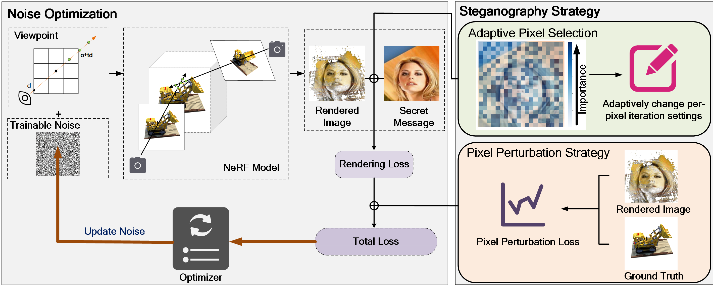
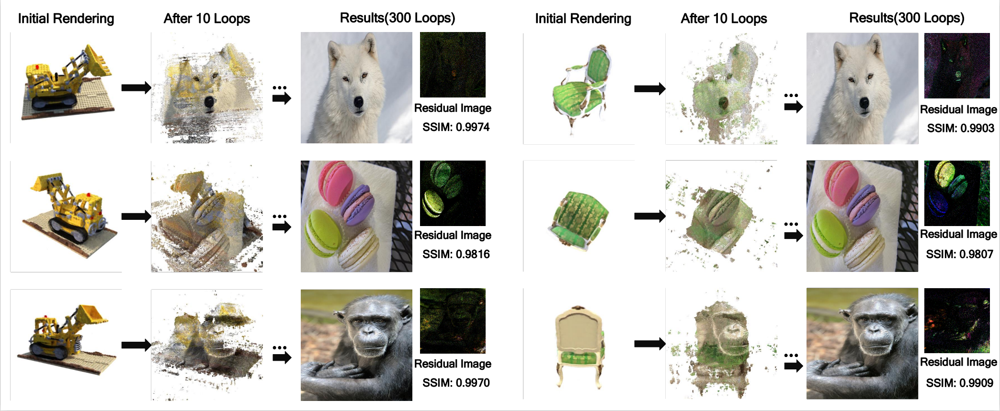

# Noise-NeRF-Hide-Information-in-Neural-Radiance-Field-Using-Trainable-Noise



## Project Installation

This project implements steganography for [NeRF](http://www.matthewtancik.com/nerf) (Neural Radiance Fields), based on [nerf-pytorch](https://github.com/yenchenlin/nerf-pytorch).
Please refer to the project's [README](https://github.com/yenchenlin/nerf-pytorch) for dependency installation instructions.

<!-- ```
pip install -r requirements.txt
``` -->

### Run Project
To play with scenes presented in NeRF, download the data [here](https://drive.google.com/drive/folders/128yBriW1IG_3NJ5Rp7APSTZsJqdJdfc1). 

---

Performing steganography on NeRF: 

```
python run_adv_nerf.py --config experiment/configs/{DATASET}.txt --target_pose_num {pose} --Adv '{Adv}.png'
```

---

Performing high-resolution image steganography on NeRF:

```
python run_adv_cut.py --config experiment/configs/{DATASET}.txt --target_pose_num {pose} --Adv '{Adv_HD}.png' --Cut
```

`{DATASET}` represents different NeRF scene datasets, `{pose}` represents the viewpoint used for steganography, and `{Adv}` represents the steganographically embedded image. See [run.sh](run.sh) for more examples.



### Reproducibility 

Check the `code_adv_test` directory for more details on the steganography code.
```
├── code_adv_test 
│   ├── test_llff.ipynb
│   ├── test_nerf_adversarial_opt.ipynb # Steganography optimization details
│   ├── test.ipynb # Test Steganography
```

## Citation
```
@inproceedings{huang2024noise,
  title={Noise-NeRF: Hide information in neural radiance field using trainable noise},
  author={Huang, Qinglong and Li, Haoran and Liao, Yong and Hao, Yanbin and Zhou, Pengyuan},
  booktitle={International Conference on Artificial Neural Networks},
  pages={320--334},
  year={2024},
  organization={Springer}
}
```
